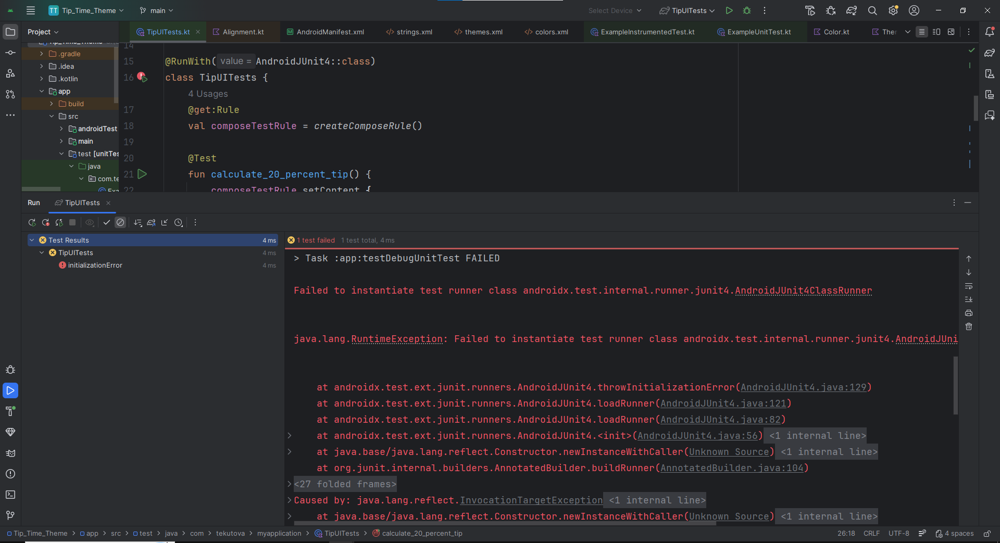

# Лабораторная работа №6-7. Взаимодействие с пользовательским
интерфейсом и State в Jetpack Compose. Написание автоматических тестов
## Описание проекта

**Tip Time Calculator** — это мобильное приложение для Android, разработанное в рамках лабораторной работы №6-7. Приложение позволяет быстро и удобно рассчитать сумму чаевых на основе суммы счета и выбранного процента. Пользователь может ввести сумму счета, указать желаемый процент чаевых, а также включить опцию округления итоговой суммы вверх. Результат отображается в реальном времени в виде отформатированной валюты.

---

## Цель работы

Познакомиться с понятием **состояния (state)** в Android-приложениях и научиться использовать его в интерфейсе с помощью **Jetpack Compose**. В результате лабораторной работы было создано приложение **Tip Time** (калькулятор чаевых), которое автоматически рассчитывает сумму чаевых на основе пользовательского ввода. Также были изучены основы написания **автоматизированных тестов** для Android-приложений (локальные и инструментальные тесты).

---

## Функциональность

Приложение поддерживает следующий набор возможностей:

- **Ввод суммы счета** — текстовое поле с числовой клавиатурой.
- **Ввод процента чаевых** — второе текстовое поле, также с числовой клавиатурой.
- **Автоматический расчет** — сумма чаевых пересчитывается в реальном времени при изменении любого параметра.
- **Округление чаевых вверх** — переключатель (Switch), который при активации округляет итоговую сумму чаевых до целого числа в большую сторону.
- **Кнопки действий на клавиатуре**:
    - Для поля "Bill Amount" — кнопка **Next** (переход к следующему полю).
    - Для поля "Tip Percentage" — кнопка **Done** (закрытие клавиатуры).
- **Адаптивный интерфейс** — поддержка портретной и альбомной ориентации с возможностью вертикальной прокрутки.
- **Локализация** — все текстовые строки вынесены в `strings.xml` для удобства перевода.
- **Material Design 3** — современный дизайн с использованием компонентов Material 3.

---

## Технологии

В проекте использованы следующие технологии и библиотеки:

| Технология | Назначение |
|------------|------------|
| **Kotlin** | Язык разработки |
| **Jetpack Compose** | Декларативный UI-фреймворк |
| **Material Design 3** | Визуальные компоненты и темы оформления |
| **Android Studio** | Среда разработки |
| **JUnit** | Фреймворк для написания локальных тестов |
| **Compose UI Testing** | Библиотека для UI-тестирования Compose-приложений |
| **Gradle** | Система сборки |

---

## Автор
Текутова В.Д. ИСП-231

Дата: 03.04.2026

---

## Известные проблемы

### Ошибка при запуске UI-тестов

При попытке запуска UI-тестa в классе **TipUITests**  возникает следующая ошибка:

